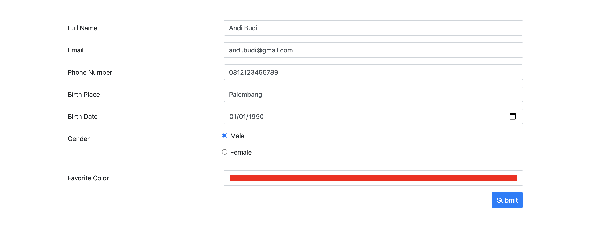
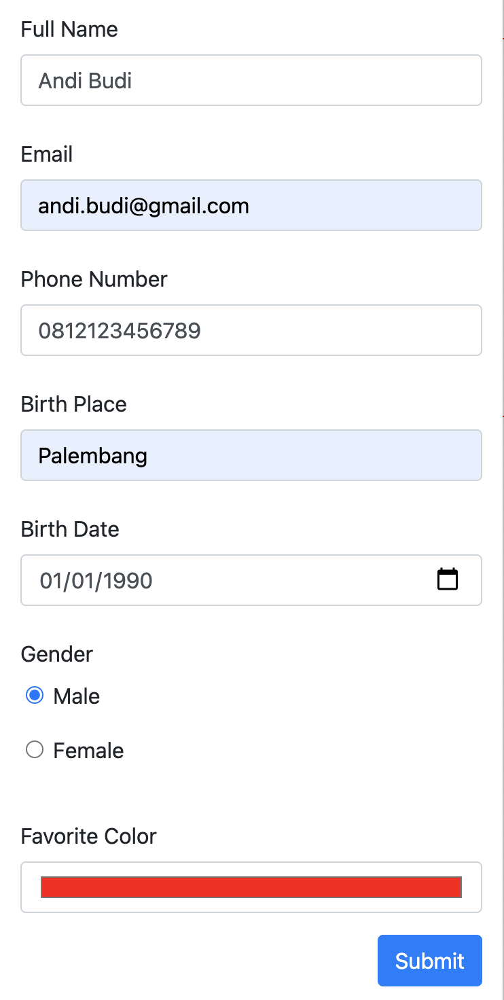
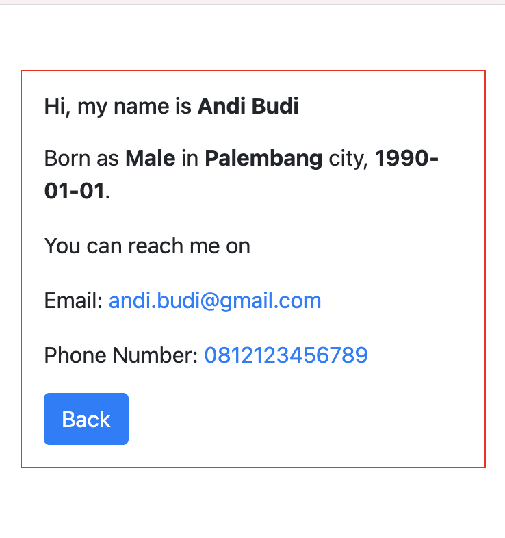

# Junior Frontend Test

## Prerequisites
1. Nodejs: "latest"
1. NPM: "latest"
1. Yarn: "latest"
1. Reactstrap: "^8.10.0"

## Language
1. Javascript

## Framework
1. Reactjs

## Duration Test
> 60 Minutes

## Objective
Create a form that generate a name card with a responsive UI. All inputs are required, birth date input must less than 2000-01-01, phone number must start with '0' character, full name and email may not greater than 255 characters.

## How To Start
1. Install node modules
    ```
    yarn install
    ```
1. Start Application
    ```
    yarn start
    ```

## Optional Objective
1. Add input upload file and show it on the result (name card)

## Expectation Test

### Web
1. Form



2. Card Name


### Responsive Mobile
1. Form



2. Card Name


